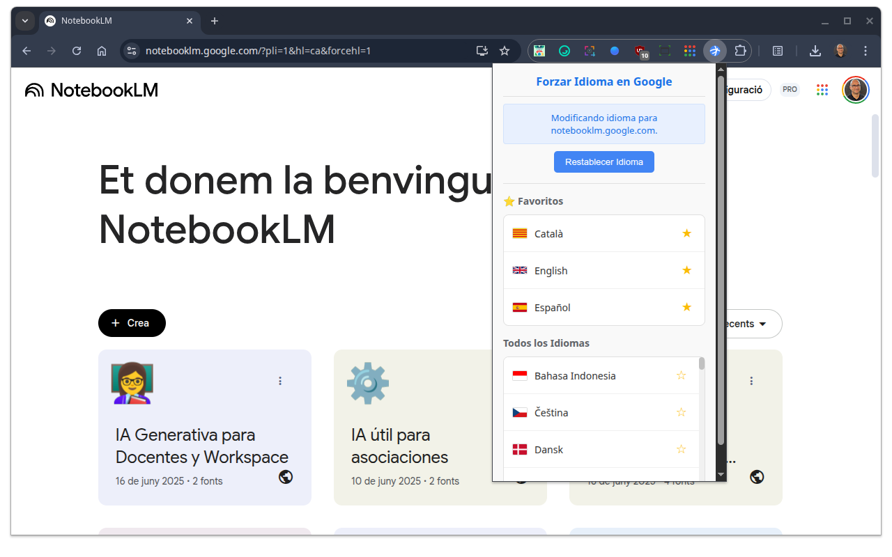

# Forzar Idioma en Google (FIG) - Extensión para Chrome

Una extensión para Chrome que permite a los usuarios forzar fácilmente el idioma de la interfaz en los servicios de Google compatibles.

## Propósito

Muchos servicios de Google determinan el idioma de su interfaz basándose en diversos factores, como la configuración de la cuenta o las preferencias del navegador. Esta extensión proporciona una forma sencilla de anular esta configuración y forzar un idioma específico para la página actual del servicio de Google mediante la modificación de los parámetros de la URL.

## Características

*   **Forzar Cambio de Idioma:** Modifica la URL actual añadiendo o actualizando los parámetros `hl` (idioma del host) y `forcehl=1` para cambiar el idioma de la interfaz.
*   **Servicios Compatibles Conocidos:** Incluye una lista predefinida de dominios de Google donde se sabe que el mecanismo de forzado de idioma funciona de manera fiable.
*   **Idiomas Favoritos:** Permite a los usuarios marcar los idiomas utilizados frecuentemente como "favoritos" para un acceso más rápido.
*   **Restablecer Idioma:** Ofrece una opción para eliminar los parámetros de forzado de idioma de la URL, volviendo al comportamiento de idioma predeterminado.
*   **Detección Automática:**
    *   Identifica si la pestaña actual es un servicio de Google compatible.
    *   Muestra una advertencia si el servicio es un dominio `google.com` pero no está en la lista de compatibles conocidos.
    *   Deshabilita la funcionalidad en páginas que no son de Google o en páginas internas del navegador.
*   **Visualización de Idiomas:** Muestra los idiomas con sus correspondientes banderas de país (utilizando una CDN) e incluye banderas locales para idiomas regionales específicos como catalán, euskera y gallego.

## Instalación

1.  **Descargar la Extensión:**
    *   **Opción 1: Desde Chrome Web Store (Recomendado cuando esté disponible)**
        *   La extensión estará disponible en la Chrome Web Store una vez que complete el proceso de revisión. (Actualmente en revisión)
        *   Busca "Forzar Idioma en Google" en la Chrome Web Store e instálala directamente.
    *   **Opción 2: Instalación Manual (desde GitHub)**
        *   Clona este repositorio o descarga el archivo ZIP y extráelo en una carpeta local.
2.  **Habilitar el Modo Desarrollador en Chrome (solo para instalación manual):**
    *   Abre Chrome y navega a `chrome://extensions`.
    *   Habilita el "Modo desarrollador" usando el interruptor en la esquina superior derecha.
3.  **Cargar la Extensión:**
    *   Haz clic en "Cargar descomprimida".
    *   Selecciona el directorio donde extrajiste los archivos de la extensión.

El icono de la extensión debería aparecer ahora en la barra de herramientas de Chrome.

## Cómo Usar

1.  Navega a un servicio de Google (por ejemplo, Google Drive, Google Calendar).
2.  Haz clic en el icono de la extensión en la barra de herramientas de Chrome.
3.  **Para forzar un idioma:**
    *   Selecciona un idioma de la lista "Todos los Idiomas" o de tu lista de "Favoritos".
    *   La página se recargará con el idioma de interfaz seleccionado.
4.  **Para restablecer el idioma:**
    *   Si se ha forzado un idioma, el botón "Restablecer Idioma" estará activo.
    *   Haz clic en "Restablecer Idioma" para eliminar los parámetros de forzado y recargar la página con el idioma predeterminado.
5.  **Para gestionar favoritos:**
    *   Haz clic en el icono de estrella (☆ o ★) junto a un idioma para añadirlo o eliminarlo de tus favoritos.

## Idiomas Incluidos

La extensión incluye una lista completa de idiomas, incluyendo los principales idiomas del mundo y muchos idiomas europeos. Las banderas se muestran utilizando `flagcdn.com`. Para idiomas regionales específicos, se incluyen iconos de banderas locales:

*   Català (Catalán)
*   Euskara (Euskera)
*   Galego (Gallego)

## Servicios Compatibles Conocidos

Se sabe que la extensión funciona con los siguientes servicios de Google:

* Analytics | `analytics.google.com`
* Calendar | `calendar.google.com`
* Classroom | `classroom.google.com`
* Consola de administración de Google Workspace | `admin.google.com`
* Drive | `drive.google.com`
* Editores de Google (Docs, Sheets, slides, Forms y Drawings) | `docs.google.com`
* Fotos | `photos.google.com`
* Gemini | `gemini.google.com`
* IDE Apps Script | `script.google.com`
* Keep | `keep.google.com`
* Looker Studio | `lookerstudio.google.com`
* NotebookLM | `notebooklm.google.com`
* Sites | `sites.google.com`
* Tasks | `tasks.google.com`

Para otros dominios `google.com`, la extensión podría funcionar, pero se mostrará una advertencia.

## Créditos

Este proyecto ha sido creado y desarrollado por [Pablo Felip](https://www.linkedin.com/in/pfelipm).

## Licencia

Este proyecto está licenciado bajo los términos del archivo `LICENSE`.